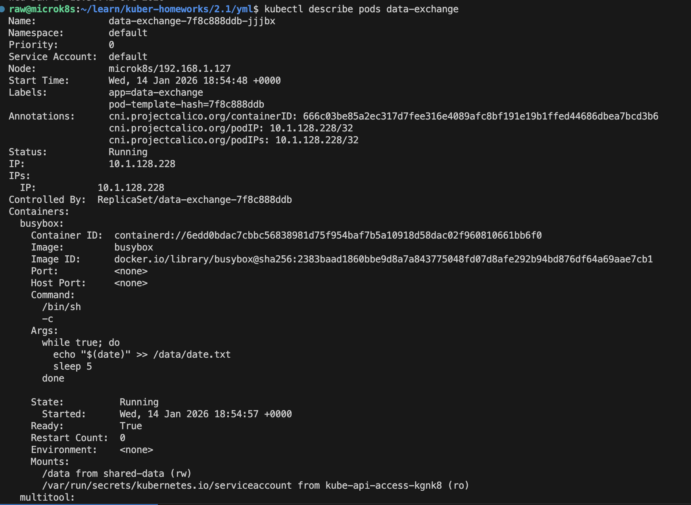
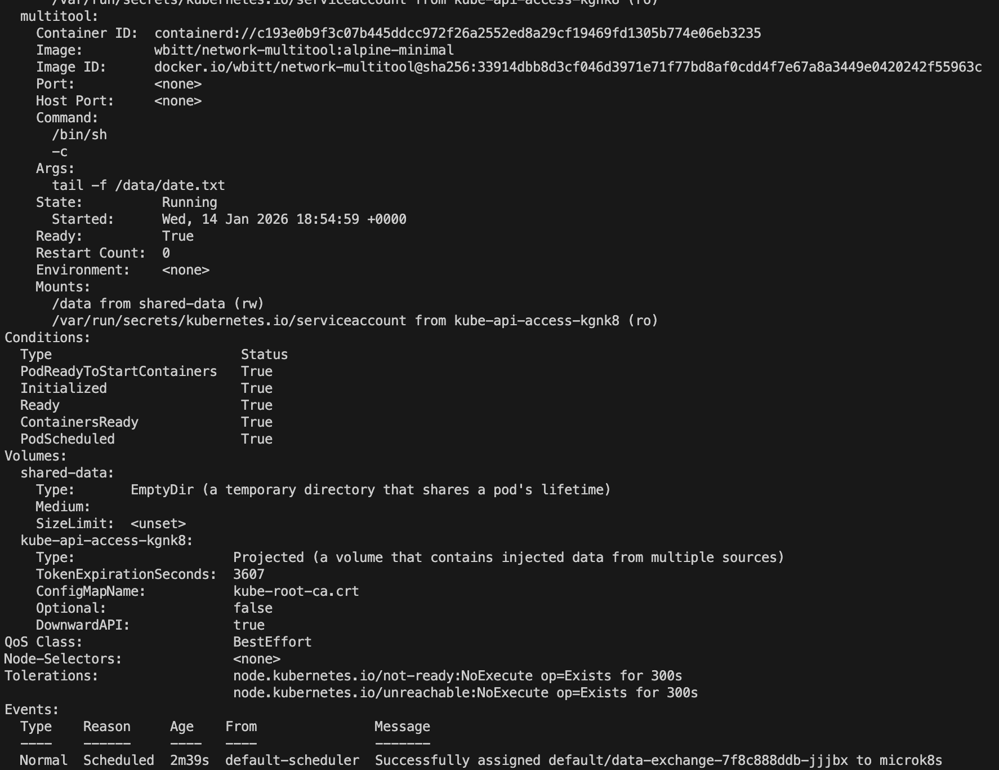
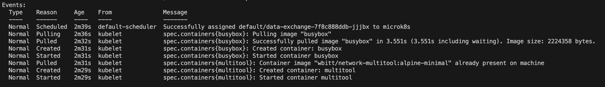
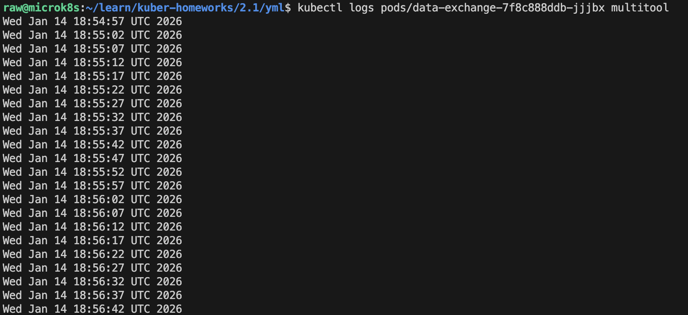

# Домашнее задание к занятию «Хранение в K8s»

## Задание 1. Volume: обмен данными между контейнерами в поде

- Манифесты:
  - `containers-data-exchange.yaml`
- Скриншоты:
  - описание пода с контейнерами (`kubectl describe pods data-exchange`)
  
  
  

  - вывод команды чтения файла (`tail -f <имя общего файла>`)
  

------

